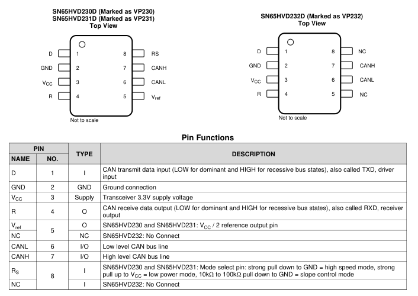

# Data acquisition and transmission

Purpose
---

The DAT system needs to collect data from the other modules and store it on a
microsd card, but also transmit it to the pits via 2 methods: MQTT and LoRa.\
The module also needs to have a RTC clock which will be set to either the time
retrieved via NTP or GPS at startup.\
The contents of the flash chip can be read by putting the module into a debug
mode and reading them through the onboard usb port.

Components used
---

### ESP32-S3-WROOM-1-N16R8

(TODO)

### Simcom7600e-h module from waveshare

This is the component that will handle data transmission via MQTT, but will
also get the current time and location of the vehicle.

The module has a UART interface using a 3 wire (TXD, RXD, GND) interface, but i
chose to also connect CTS and RTS for hardware control flow, DTR which puts the
module's uart interface in sleep mode, and RI which will cause a interrupt (high
to low) when receiving a phone call or sms. ([[1]] on page 7 to 11)\
Voltage in is between 5v and 26v, so I connected it to the 12v battery on the
car.\
The module also has a reset pin, which i connected to the esp32.
(Ground is connected to ground).\
All other pins can be left floating (as per the reference design or what i
deducted from the module schematic).

The module itself has a sim card slot and antenna inputs which will need to
be connected to a external antenna.

### LoRa-E5

This module provides LoRa wireless communication. It interfaces with the
microcontroller via a 3 wire (TXD, RXD, GND) UART interface, it also has a reset
pin, and a pin to enter boot upgrade mode. Besides these and power, all other
pins can be left floating as per the reference design. [[2]]

### SN65HVD230DR

This is a CAN transciever with a speed for up to 1Mbps.

### Miscrosd

The microsd is used to store logged data locally on multiple binary files.
The pins are connected according to the following reference design, but with
different IO pins on the esp32 side.

### MAX31331TETB+

The MAX31331TETB+ is a RTC chip with a backup supply pin, to which it will
switch automatically when the main supply drops below a programmed voltage.
The chip also features a trickle charger for the backup battery.
It is accessed through a I2C interface.

The VCC and GND pins are connected to the power supply.\
The SDA and SCL pins are connected to the I2C bus of the microcontroller.\
The X1 and X2 pins are connected to a external crystal.\
DIN is a input to the RTC and INTA is a interrupt generated by the RTC on:
Alarm2, timer, PFAIL, and DIN (configurable)\
INTB should be connected ground if unused.

### Power delivery

(TODO)

[1]: <https://www.microchip.ua/simcom/LTE/SIM7500_SIM7600/Application%20Notes/SIM7100_SIM7500_SIM7600%20Series_UART_Application%20Note_V3.00.pdf>
[2]: <https://files.seeedstudio.com/products/317990687/res/LoRa-E5%20module%20datasheet_V1.1.pdf> "LoRa-E5 datasheet"

